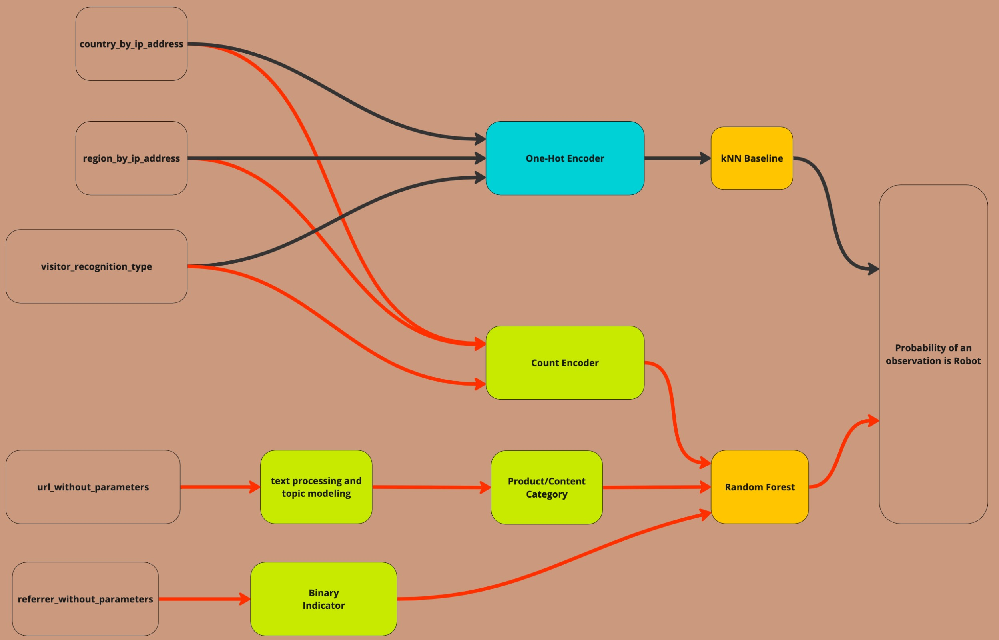
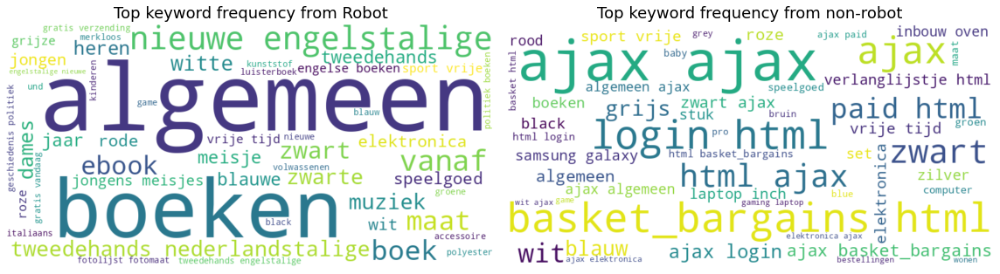
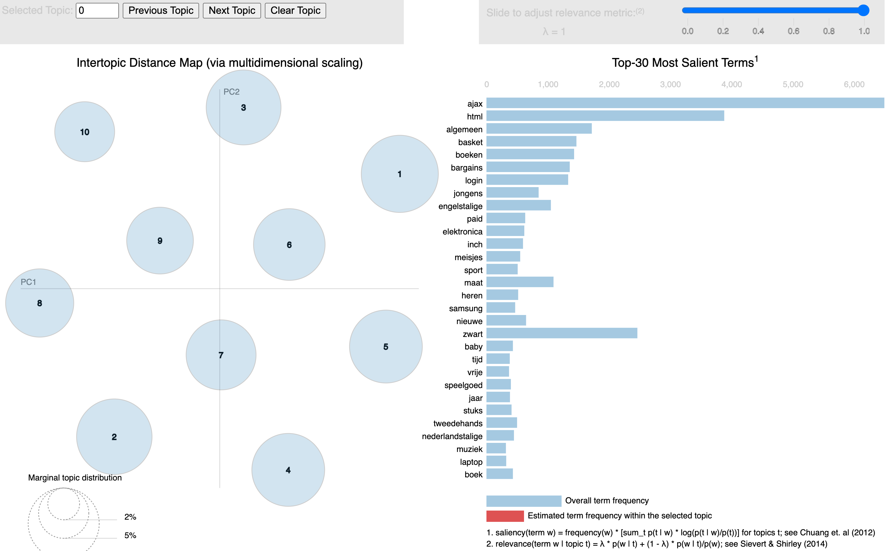
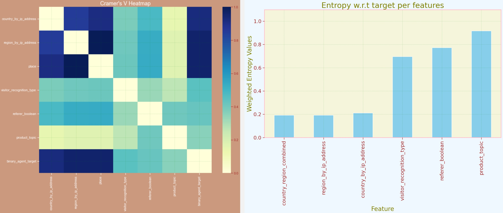

# robot-detection
Detect Robot Traffic in an e-commercial website

# Problem Definition

For any online company, web traffic is a vital source of information. By using the logs our servers generate, we have source material to find answers to a wide array of questions about our business. You can think of analysing the logs to optimise sites and pages based on user behaviour or to detect and mitigate imminent threats.
Depending on the analysis, we are interested in either traffic generated by real people, or bot traffic: non-human traffic (NHT).
The aim is to identify the type of traffic we see coming onto our servers.

# Data Overview

* Robot accounts for ~70% of traffic
* Traffic from California of USA accounts for ~70% of traffic
* Most traffics (> 80%) are anonymized
* Data are only available from 20-22 for 1 day, and also we don't know when the session ends, so it's unlikely time feature (or seasonality) plays an important role here
* >95% traffic comes from Browsers and Robots, we can simplify the multi-label classification problem into binary classication between Robots vs. non-Robots. Any multi-label classication problem can be divided into multiple binary classification anyway, with one vs.rest strategy
* The class Robot/non-Robot is imbalance ~0.6/1, so it's imbalance binary classification
* It seems there're 3 consistent features: country, region, and visitor recognition type. In fact, country and region can be combined into 1 feature e.g. place

# Approach

## Simple Feature Engineering

First, we visualize top keywords frequency from URL.

* We noted there're some distinction in product keywords between Robot and non-Robot. Traffic from Robot focuses on general, book or language topics, while traffic driven by non-Robot would center around ajax, or sports

We can approximately extract the product category feature from url by topic modeling using Latent Dirichlet Allocation, divided into 10 different product topics. The assumption is that bot/robot browsing are only interested in some specific products.

Now, with the new feature (topic), we can check association and correlation:

* Each bubble represents a topic. The area of these topic bubles is proportional to the amount of words that belong to each topic across the dictionary. The bubles are plotted using a multidimensional scaling algorithm (dimensional reduction) based on the words they comprise, so topics that are closer together have more words in common.
* Blue bars represent the overall frequency of the term across the entire corpus. Salient is a specific metric for topic identity. Higher saliency values indicate that a word is more useful for identifying a specific topic. 
* Red bars estimate frequency of the term in a selected topic
* Relevance aims to highlight terms that are not only important within a specific topic but also distinctive to that topic compared to their general frequency in the corpus.

* We see obvisouly location features are the most predictive here, to distinguish between Robots and nonRobots
* `product_topic` has the highest entropy (least predictive), but it's noted it also means there's some improvement needed in text and topic modeling
* It is obvious place and robots are highly associated. This means, e.g. if a traffic is from US_CA, it's highly likely Robot traffic
* There's no strong evidence and association that Robot only targets some specific product

## Modeling
For simplicity, the data were split into train/test data before modeling, assuming all columns/features are still the same in the test set. However it's noted some corner cases which can happen in reality, e.g.:
* There're new countries/regions in the test set which are unavailable in the training set
* Or new product categories in the test set
